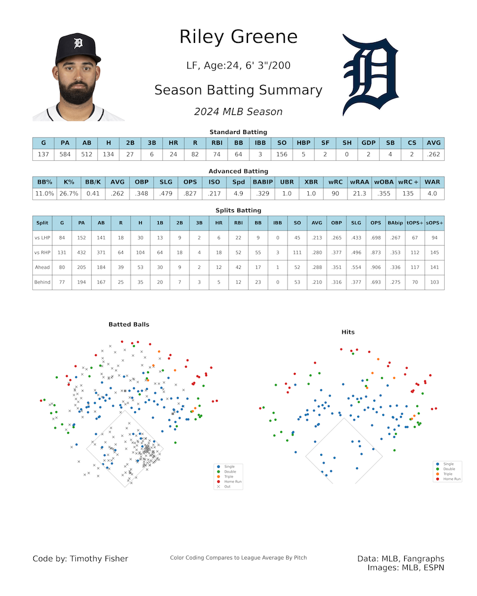
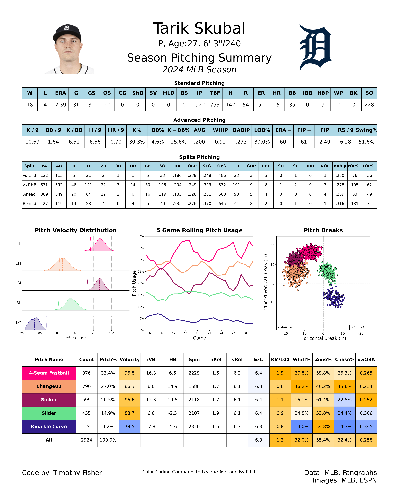

# MLB Stats

`MLB Stats` is a Python-based project that reads MLB statistics from a remote API, processes the data, and generates summary sheets for MLB players and teams. This project leverages the `pybaseball` module and other Python libraries to fetch, analyze, and format data for use in reports, dashboards, or other applications.

This project uses data sourced from MLB and Fangraphs.

## Sample Summary Sheets
<div style="display: flex; flex-direction: row;">
<div class="sheet_images" style="width:300px; padding:20px">

  

</div>
<div class="sheet_images" style="width:300px;padding:20px">

  
</div>

</div>


## Project Structure

  

The project directory is structured as follows:

Coming Soon

  
  

## Installation


To get started with the project, follow these steps:

1. Clone the repository:

```bash
git clone https://github.com/your-username/mlb_summary_sheets.git
cd mlb_stats
```

2. Set up a Python virtual environment (optional but recommended):
```bash
python3 -m venv venv
source venv/bin/activate
```

3. Install the required dependencies:

```bash
pip install -r requirements.txt
```

## Usage

Run the project by executing the main script in the `scripts` directory:
```bash
python scripts/main.py
```

## Inspiration

This project was inspired by the pitching summary project from Thomas Nestico. Here is a link to an article describing his project:

https://medium.com/@thomasjamesnestico/creating-the-perfect-pitching-summary-7b8a981ef0c5
